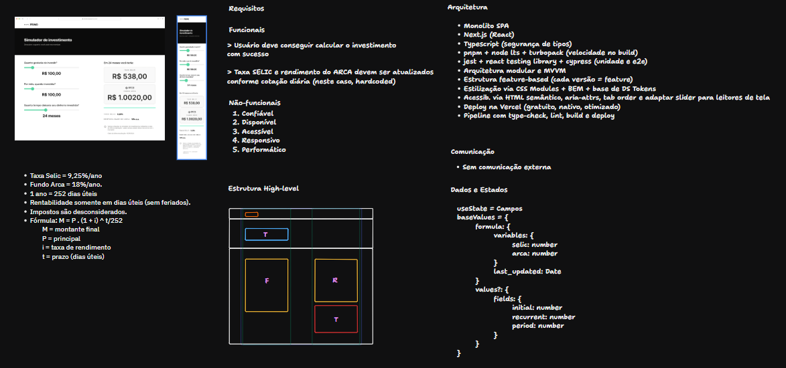
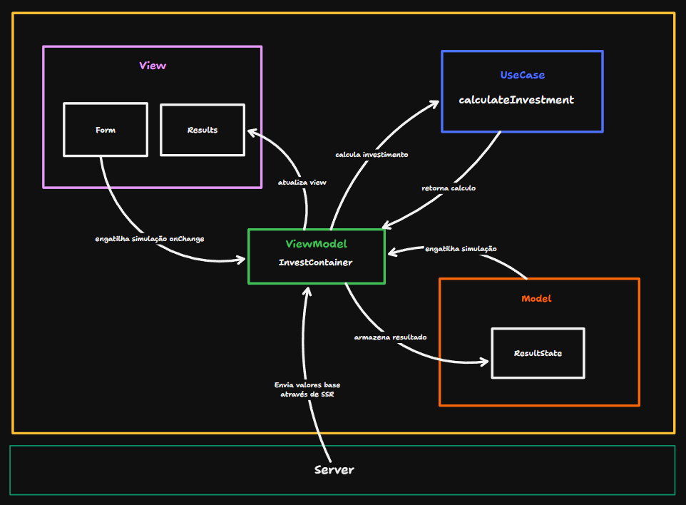
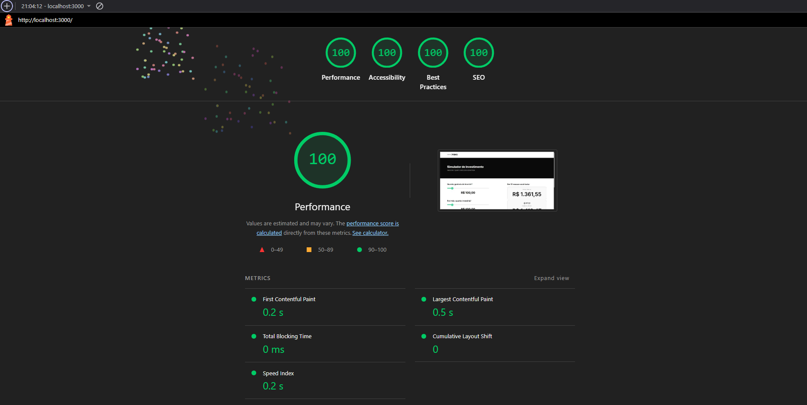

# Simulador de Investimentos - Primo Invest Calc

[](https://opensource.org/licenses/MIT)

Desafio front-end da empresa Grupo Primo: Um simulador de investimentos moderno e interativo, construído com Next.js e TypeScript. A aplicação permite que os usuários calculem e comparem a rentabilidade de um investimento inicial somado a aportes mensais, contrastando a performance da Taxa Selic com a do Fundo Arca, seguindo o padrão de arquitetura MVVM.

Detalhes disponíveis em: [desafio.md](docs/desafio.md)


## 🎨 Protótipo (Figma)

O design da interface e a experiência do usuário foram planejados no Figma. Você pode acessar o protótipo através do link abaixo:

- **[Acessar o Protótipo no Figma](https://www.figma.com/design/N1MRNvIBNwzXXu0w5N9P3w/Calculadora-Grupo-Primo?node-id=0-1&t=WhKV1bPD8G2V2xRG-1)**

## 🎯 Requisitos do Projeto

O desenvolvimento foi guiado pelos seguintes requisitos funcionais e não-funcionais.

### Requisitos Funcionais

- O usuário deve conseguir calcular o rendimento de um investimento com sucesso.
- As taxas SELIC e do Fundo Arca devem ser atualizadas conforme a cotação (neste caso, hardcoded para a simulação).

### Requisitos Não-Funcionais

1.  **Confiável**: Cálculos precisos e comportamento previsível.
2.  **Disponível**: Acesso garantido através de deploy otimizado na Vercel.
3.  **Acessível**: Conformidade com as diretrizes do WCAG, garantindo usabilidade para todos.
4.  **Responsivo**: Experiência de usuário fluida em desktops e dispositivos móveis.
5.  **Performático**: Carregamento rápido e interações instantâneas.

## 🚀 Design System



## 🏛️ Arquitetura e Padrão de Projeto

O projeto foi estruturado utilizando o padrão de arquitetura **MVVM (Model-View-ViewModel)** para garantir uma separação clara de responsabilidades, alta testabilidade e manutenibilidade do código.



- **View**: A camada de interface do usuário, composta por componentes React passivos (`Form`, `Result`). É responsável apenas por exibir os dados e capturar as interações do usuário.
- **Model**: Gerencia o estado da aplicação. No nosso caso, o `ResultState` que contém os valores do resultado da simulação feita pelo usuário.
- **ViewModel** (`InvestmentCalc` container): Atua como a ponte entre o Model e a View. Ele recebe os eventos da View, aciona os UseCases (lógica de negócio), atualiza o Model e expõe os dados formatados para a View. Os dados iniciais (taxas) são injetados via SSR.
- **UseCase** (`calculateInvestment`): Uma função pura que contém a lógica de negócio central. Ela recebe os dados do formulário e as taxas, e retorna o resultado do cálculo, sem acoplamento com a UI.

## ⚡ Performance

A aplicação foi otimizada para performance, alcançando **pontuações máximas** nas métricas do Google Lighthouse e excelentes Core Web Vitals, garantindo uma experiência de usuário extremamente rápida.



- **First Contentful Paint (FCP):** **0.2s**
- **Largest Contentful Paint (LCP):** **0.5s**
- **Total Blocking Time (TBT):** **0 ms**
- **Cumulative Layout Shift (CLS):** **0**

## 🛠️ Tech Stack

- **Framework**: [Next.js](https://nextjs.org/) (com Pages Router e Turbopack)
- **Linguagem**: [TypeScript](https://www.typescriptlang.org/)
- **Deployment**: [Vercel](https://vercel.com/)
- **Estilização**: CSS Modules + BEM
- **Testes Unitários/Integração**: [Jest](https://jestjs.io/), [React Testing Library](https://testing-library.com/)
- **Testes End-to-End**: [Cypress](https://www.cypress.io/)
- **Mocking de API**: [Mock Service Worker (MSW)](https://mswjs.io/)
- **Qualidade de Código**: [ESLint](https://eslint.org/) e [Prettier](https://prettier.io/)
- **Desenvolvimento de Componentes**: [Storybook](https://storybook.js.org/)
- **Gerenciador de Pacotes**: [pnpm](https://pnpm.io/)
- **Git Hooks**: [Lefthook](https://github.com/evilmartians/lefthook)
- **CI/CD**: Vercel

## 📂 Estrutura do Projeto

A estrutura de pastas foi organizada para promover a modularidade e a escalabilidade:

```
primo-invest-calc/
├── .github/              # Workflows de CI/CD (GitHub Actions)
├── .lefthook/            # Configuração dos Git Hooks
├── public/               # Arquivos estáticos (imagens, fontes)
├── scripts/              # Scripts de automação (build, test, etc.)
├── stories/              # Arquivos de histórias do Storybook (*.stories.tsx)
├── tests/                # Utilitários, mocks e configurações de teste
├── types/                # Definições de tipos globais do TypeScript (*.d.ts)
└── main/
    └── modules/          # Contêiner para os principais módulos da aplicação
        ├── core/         # Funcionalidades centrais e compartilhadas (hooks, utils)
        ├── ds/           # Design System: componentes de UI, tokens e contratos
        └── app/          # Módulo principal da aplicação de investimento
            └── InvestmentCalc/   # Feature específica do Simulador de Investimento
                ├── api/          # Rotas de API (server-side handlers)
                ├── components/   # Componentes React de UI ('dumb components')
                ├── containers/   # Componentes que gerenciam estado e lógica ('smart components')
                ├── models/       # Definições de tipos para estruturas de dados
                ├── pages/        # Páginas da aplicação e sistema de rotas (Next.js)
                ├── rules/        # Lógica de negócio e regras de cálculo
                └── utils/        # Funções utilitárias específicas da feature
```

## 🚀 Começando

### Pré-requisitos

- [Node.js](https://nodejs.org/) (**versão 22.x ou superior**)
- [pnpm](https://pnpm.io/installation)

### Instalação

1.  **Clone o repositório:** `git clone https://github.com/alencarftc/primo-invest-calc.git`
2.  **Entre na pasta:** `cd primo-invest-calc`
3.  **Instale as dependências:** `pnpm install`
4.  **Rode o servidor de desenvolvimento:** `pnpm dev`

Abra [http://localhost:3000](http://localhost:3000) no seu navegador.

## 📜 Scripts Disponíveis

| Comando                | Descrição                                                          |
| ---------------------- | ------------------------------------------------------------------ |
| `pnpm dev`             | Inicia a aplicação em modo de desenvolvimento com Turbopack.       |
| `pnpm build`           | Executa o script de build customizado (ver `./scripts/build.sh`).  |
| `pnpm build:final`     | Executa o script de build para o ambiente de produção.             |
| `pnpm start`           | Inicia um servidor de produção com a build gerada.                 |
| `pnpm test`            | Roda a suíte de testes completa com Jest.                          |
| `pnpm test:dev`        | Roda testes em arquivos específicos com cobertura de código.       |
| `pnpm type-check`      | Verifica a tipagem de todo o projeto com TypeScript.               |
| `pnpm lint`            | Roda o ESLint para encontrar e corrigir problemas no código.       |
| `pnpm lint:check`      | Roda o ESLint apenas para verificar (sem corrigir), ideal para CI. |
| `pnpm format`          | Roda o Prettier para formatar todos os arquivos do projeto.        |
| `pnpm format:check`    | Roda o Prettier para verificar a formatação (sem corrigir).        |
| `pnpm validate`        | Executa todas as checagens de qualidade: tipos, lint e formatação. |
| `pnpm storybook`       | Inicia o ambiente do Storybook para visualização dos componentes.  |
| `pnpm build-storybook` | Gera a build estática do Storybook.                                |

## 🤝 Contribuindo

1.  Faça um **Fork** do repositório.
2.  Crie uma nova **Branch** (`git checkout -b feature/sua-feature`).
3.  Faça o **Commit** das suas mudanças (`git commit -m 'Adiciona nova feature'`).
4.  Faça o **Push** para a sua branch (`git push origin feature/sua-feature`).
5.  Abra um **Pull Request**.

## 📄 Licença

Este projeto está sob a licença MIT. Veja o arquivo [LICENSE](LICENSE) para mais detalhes.
